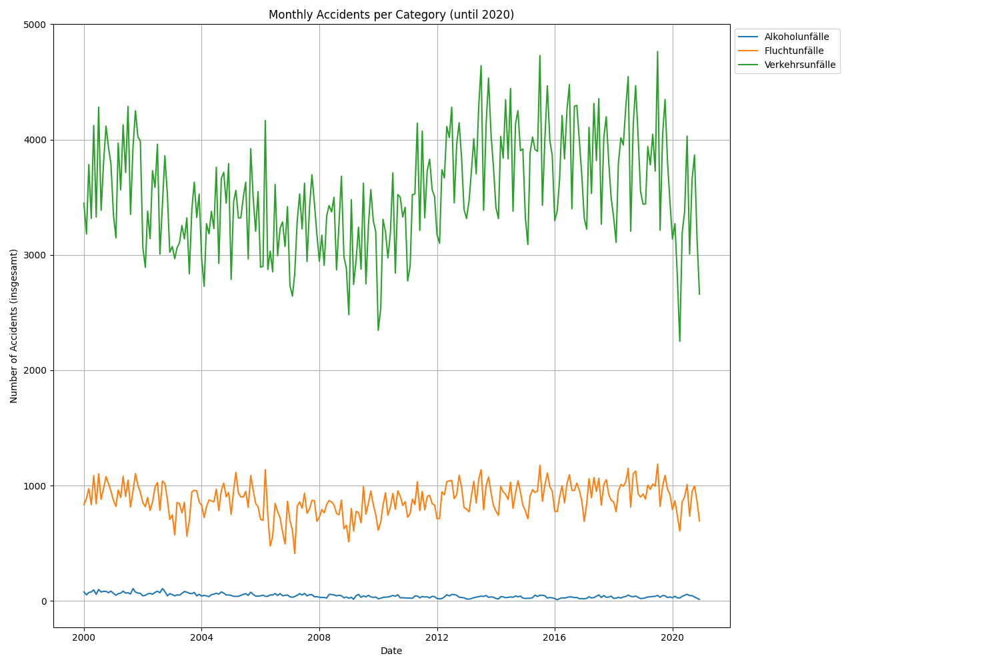

# DPS Challenge - Accident Data Analysis and Prediction

This project analyzes monthly accident data, trains forecasting models for different accident categories, provides an API to get predictions, and includes a Docker setup for easy deployment.

## Project Structure

```

├── Dockerfile
├── __pycache__/
├── api.py
├── data.csv
├── data_utils.py
├── models/
├── plots/
│   └── monthly_accidents_per_category.png
├── requirements.txt
├── train_model.py
└── visualize.py
```

## Development Steps

1.  **Data Loading and Preprocessing (`data_utils.py`):**
    *   Loaded the `data.csv` file.
    *   Cleaned and preprocessed the data, ensuring correct date formats and handling missing values.
    *   Filtered data up to the year 2020 for initial analysis and visualization.

2.  **Data Visualization (`visualize.py`):**
    *   Created a plot showing monthly accidents per category over time.
    *   Saved the visualization to `plots/monthly_accidents_per_category.png`.

3.  **Model Training (`train_model.py`):**
    *   Implemented SARIMA models for time series forecasting.
    *   Trained separate models for each accident category using data up to 2020.
    *   Saved the trained models to the `models/` directory using `joblib`.

4.  **API Development (`api.py`):**
    *   Built a FastAPI application.
    *   Created an endpoint `/predict` that accepts a future date and returns predictions for all categories.
    *   Loaded the pre-trained models on startup.

5.  **Dockerization (`Dockerfile`):**
    *   Created a Dockerfile using a Python base image.
    *   Installed dependencies from `requirements.txt`.
    *   Copied the application code and models into the container.
    *   Exposed port 8000 and defined the command to run the FastAPI application using Uvicorn.

## Visualization

Here is the visualization of monthly accidents per category up to 2020:




## Access the API:
*   The API will be available at `imperial-glenna-moaksh-06f63fb9.koyeb.app/`.
*   You can access the interactive documentation (Swagger UI) at `imperial-glenna-moaksh-06f63fb9.koyeb.app//docs`.
*   To get predictions, send a GET request to `imperial-glenna-moaksh-06f63fb9.koyeb.app//predict?future_date=YYYY-MM-DD` (e.g., `imperial-glenna-moaksh-06f63fb9.koyeb.app//predict?future_date=2024-12-31`).